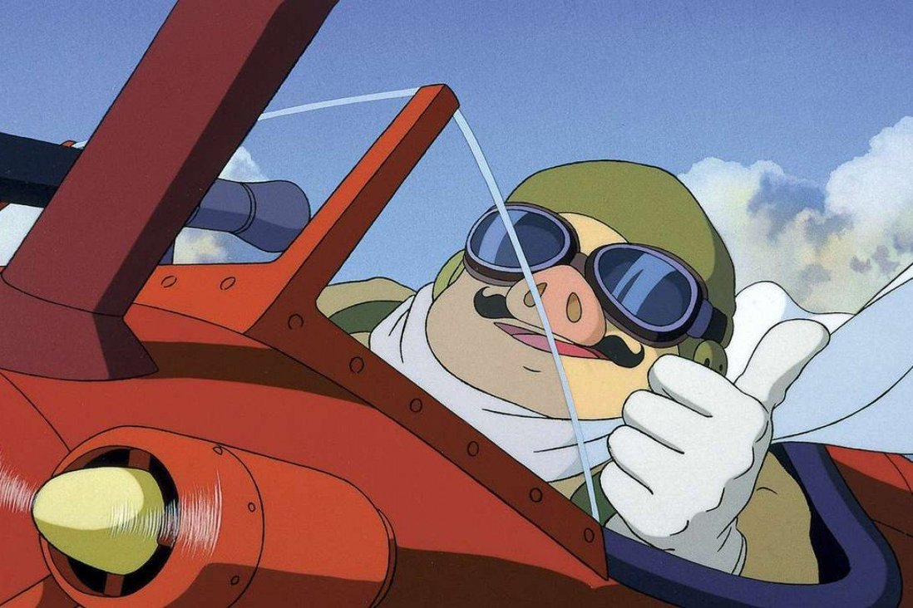
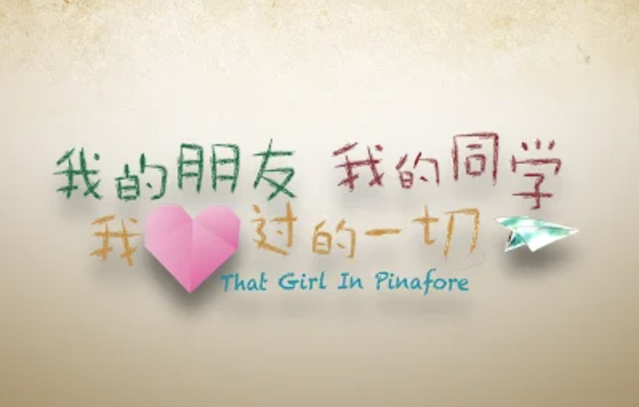
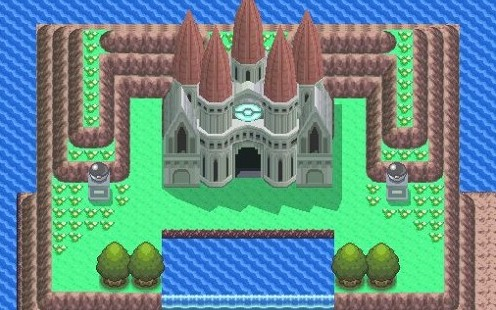
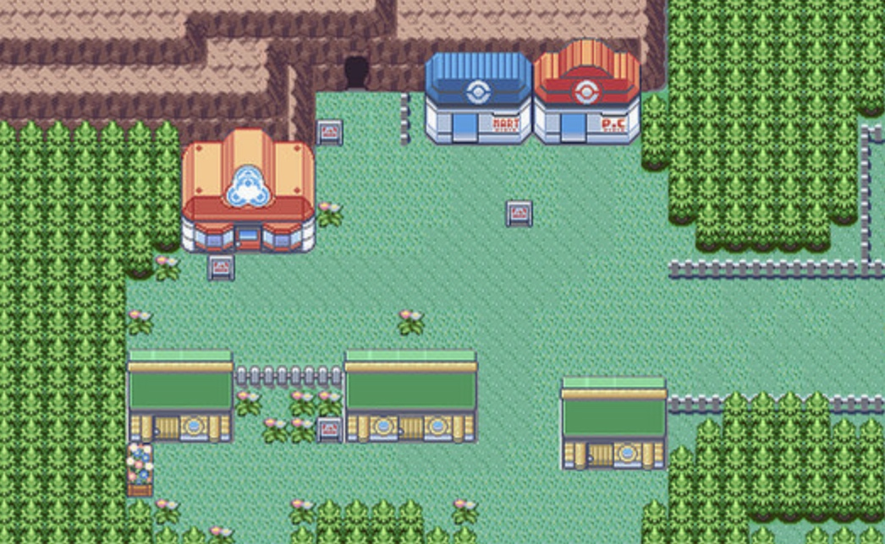
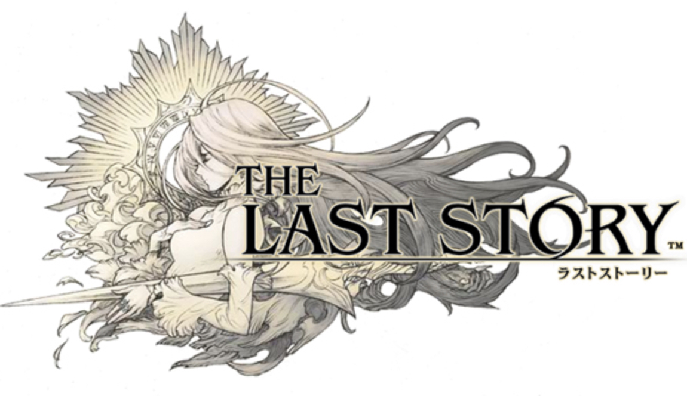
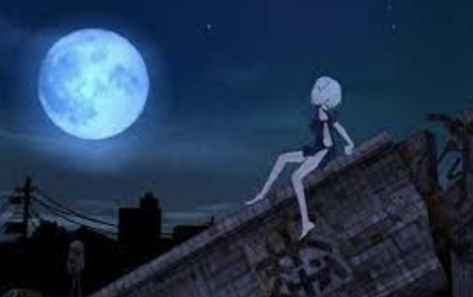

  <h1 align="center">🎹 Piano Sheet Transcriptions</h1>

I occasionally dabble in piano sheet transcriptions for songs that I'm looking to learn, mainly when there is no existing sheet music that I can find or when it's not to my liking.

 

## Pokémon RSE - Ending Theme

The beautiful ending theme that plays as the credits roll in Pokémon Ruby/Sapphire/Emerald.

- [Sheet](./sheet-music/pokemon-rse-ending-theme.pdf)
- [Audio](https://www.youtube.com/watch?v=KmlFDnsT4Zk)

 

## Porco Rosso - The Bygone Days

From the Studio Ghibli film Porco Rosso; based on the fantastic version played by Joe Hisaishi during the "Joe Hisaishi in Budokan - Studio Ghibli 25 Years" concert.

- [Sheet](./sheet-music/porco-rosso-the-bygone-days.pdf)
- [Audio](https://www.youtube.com/watch?v=QsowHW0t7CA)

 

## That Girl in Pinafore - 你的倒影

Xinyao song from the Singaporean film "That Girl in Pinafore".

- [Sheet](./sheet-music/that-girl-in-pinafore-ni-de-dao-ying.pdf)
- [Audio](https://www.youtube.com/watch?v=27VqrAfj6OU)

  

## Pokémon DPPt - Pokémon League

<!-- source: https://i1.sndcdn.com/artworks-000325264624-pcbcsf-t500x500.jpg -->

A tranquil respite after conquering Victory Road before facing the Elite Four.

- [Sheet](./sheet-music/pokemon-dppt-pokemon-league.pdf)
- [Audio](https://www.youtube.com/watch?v=h1eBGWxAs74)

  

## Pokémon RSE - Verdanturf Town

<!-- source: https://pianu.com/wp-content/uploads/2019/10/download-2.jpg -->

The town known for its very clean air; one of the all-time top Pokémon soundtracks.

- [Sheet](./sheet-music/pokemon-rse-verdanturf-town.pdf)
- [Audio](https://www.youtube.com/watch?v=MHFBO-ASaE8)

 

## The Last Story - Toberu Mono

<!-- source: https://www.wired.com/images_blogs/gamelife/2012/02/last-story-660.jpg -->

Theme song from a Japanese game "The Last Story".

- [Sheet](./sheet-music/the-last-story-toberu-mono.pdf)
- [Audio](https://www.youtube.com/watch?v=zDiEIzDa5VM)

  

## Fragile Dreams: Farewell Ruins of the Moon - To All People

From a Japanese game "Fragile Dreams: Farewell Ruins of the Moon".

- [Sheet](./sheet-music/fragile-dreams-farewell-ruins-of-the-moon-to-all-people.pdf)
- [Audio](https://www.youtube.com/watch?v=2pPsJd6bPOM)
